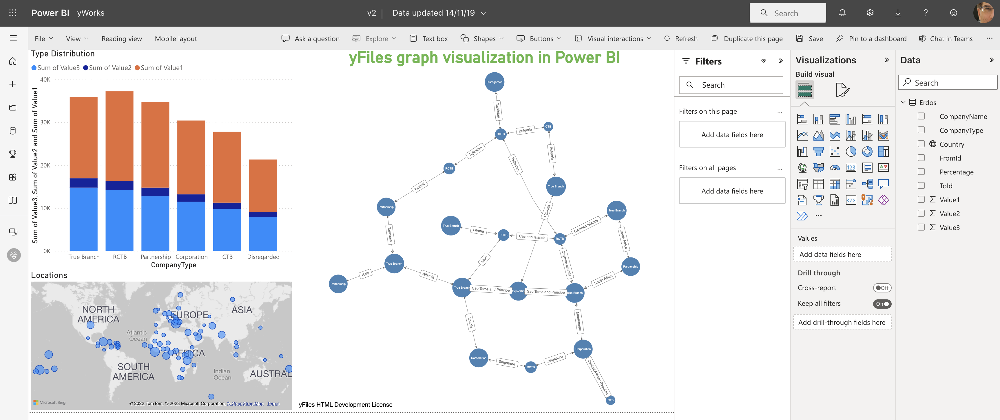
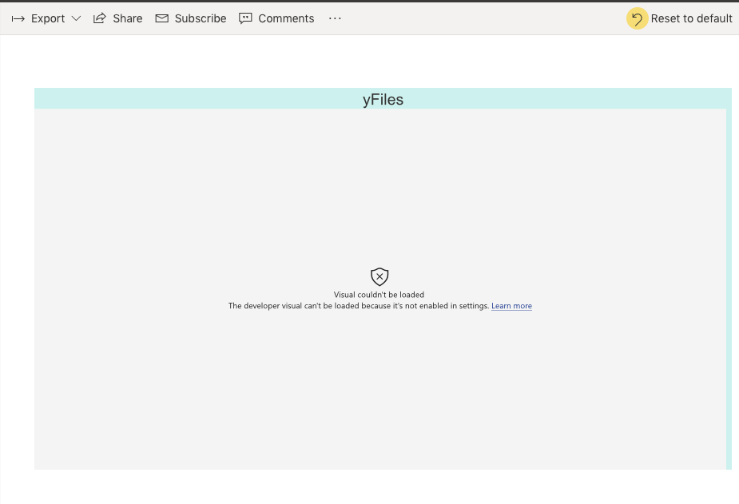
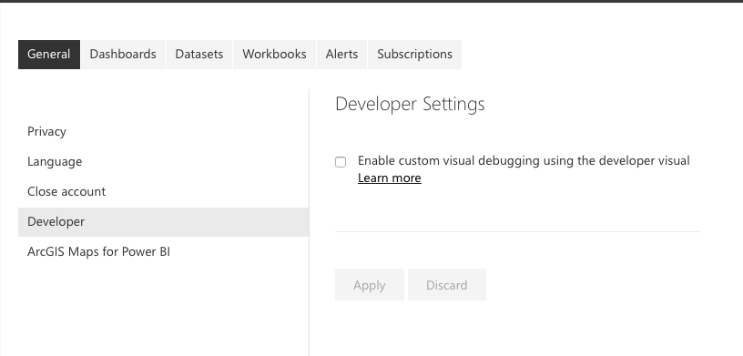

# Basic integration of yFiles for HTML in Power BI


This sample demonstrates how to get [yFiles diagrams](https://yworks.com/yfiles) into a [Power BI](https://powerbi.microsoft.com/) dashboard with dataset integration. It's a minimal integration without lots of customizations and editing features and should be a stepping stone for your particular use-case. All the [yFiles customizations](https://live.yworks.com/) and the full breadth of the [yFiles API](https://docs.yworks.com/yfileshtml/) can be used inside PowerBI. Aside from a few Power BI details, there is very little difference with respect to any other web development effort.  

The data required to build a graph should have at least a `FromId` and a `ToId` defining the edge endpoints. Other fields can optionally be used for edge and node labels. Since a Power BI report can be based on only one data table, it means that you can't have the incidence (edge definitions) and node data in separate tables.

A good practice here is to have all the relevant node fields in the table plus one extra field defining and edge. This means that you, inevitably, will have some denormalized data if the graph is not a tree but this is quite common and shouldn't be a problem in general.

## Installation

### Install Power BI tools

The tutorial [Developing a Power BI visual](https://docs.microsoft.com/en-us/power-bi/developer/custom-visual-develop-tutorial) details the steps to create a custom visual and applies to this yFiles widget as well.
The most import elements in this tutorial are:

Installing the Power BI tools for Node.js:
```bash
npm i -g powerbi-visuals-tools
```

Registration of a Power BI certificate for localhost:
```bash
pbiviz --install-cert
```

Starting the custom Power BI development server:
```bash
  pbiviz start
```

If the certificate is still giving problems with an error like _"net::ERR_CERT_COMMON_NAME_INVALID"_, it's because the Chrome browser blocks the address https://localhost:8080 because of a non-valid certificate.
Please open the following link in separate browser tab: https://localhost:8080/assets/status. Chrome will show the warning message, click `advanced > proceed` to unsafe version. After that, Chrome will work with the development visual correctly.

You can use any browser to enjoy Power BI dashboards, but Chromium browsers like Edge and Chrome are aptest for debugging custom visuals.

If you see an error like the one below



it's because the visual debugging is not set in the settings:



### Install yFiles

By default, this sample expects the yFiles for HTML library and a yFiles license in the `./yFiles` directory, namely the files `./yFiles/yfiles-2.5.0.3+dev.tgz` and `./yFiles/license.json`.

To change this, modify the files `./package.json` and `./src/visual.ts`, respectively.

## Data mapping

The yFiles widget consumes a shared dataset. The desktop version of Power BI allows multiple sets, but the online only allows one dataset per report. It is via this shared dataset that the widgets within one report can communicate (slicing etc.).
In order to have a graph, one needs at least two fields:

- **NodeId**: an id defining the start of an edge. This can be a unique identifier from an entity (say from a database). Internally this id is converted to a string.
- **TargetId**: an id of another entity defining the sink of an edge.

All other fields are optional, but you will normally also wish to define:

- the **main label**: the central label shown in the node
- the **edge label**: shown next to the edge, by default at the beginning or source of an edge

## Styling

The widget doesn't define any properties targeting the diagramming style in order to keep the code tidy and easy to extend.
Refer to [the yFiles documentation](https://docs.yworks.com/yfileshtml/#/dguide/styles) to learn more about the many styling and [automatic layout](https://docs.yworks.com/yfileshtml/#/dguide/layout) options.

## Filtering and slicing

The diagramming widget will react to any filter or slicing but not the other way around in order to keep the code simple and reusable.

## Feedback

For help or feedback use [GitHub issues](https://github.com/yWorks/yfiles-power-bi-integration-basic/issues) or [Tweet us](https://twitter.com/yworks). You can also [mail us directly](mailto:hello@yWorks.com).

## License

The MIT License (MIT)

Copyright (c) 2015-2023 yWorks GmbH

Permission is hereby granted, free of charge, to any person obtaining a copy of this software and associated documentation files (the "Software"), to deal in the Software without restriction, including without limitation the rights to use, copy, modify, merge, publish, distribute, sublicense, and/or sell copies of the Software, and to permit persons to whom the Software is furnished to do so, subject to the following conditions:

The above copyright notice and this permission notice shall be included in all copies or substantial portions of the Software.

THE SOFTWARE IS PROVIDED "AS IS", WITHOUT WARRANTY OF ANY KIND, EXPRESS OR IMPLIED, INCLUDING BUT NOT LIMITED TO THE WARRANTIES OF MERCHANTABILITY, FITNESS FOR A PARTICULAR PURPOSE AND NONINFRINGEMENT. IN NO EVENT SHALL THE AUTHORS OR COPYRIGHT HOLDERS BE LIABLE FOR ANY CLAIM, DAMAGES OR OTHER LIABILITY, WHETHER IN AN ACTION OF CONTRACT, TORT OR OTHERWISE, ARISING FROM, OUT OF OR IN CONNECTION WITH THE SOFTWARE OR THE USE OR OTHER DEALINGS IN THE SOFTWARE.
